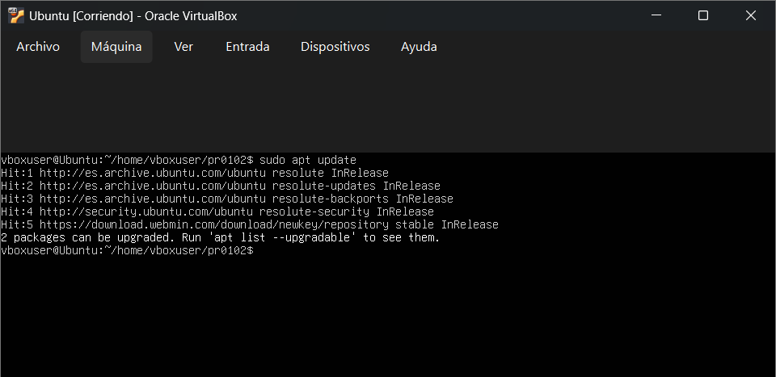
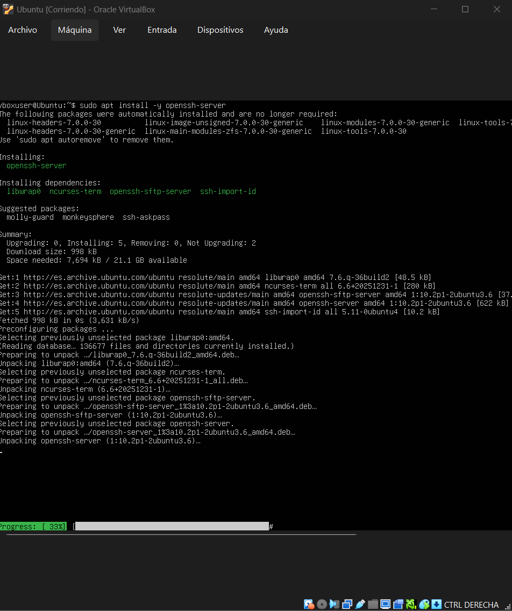
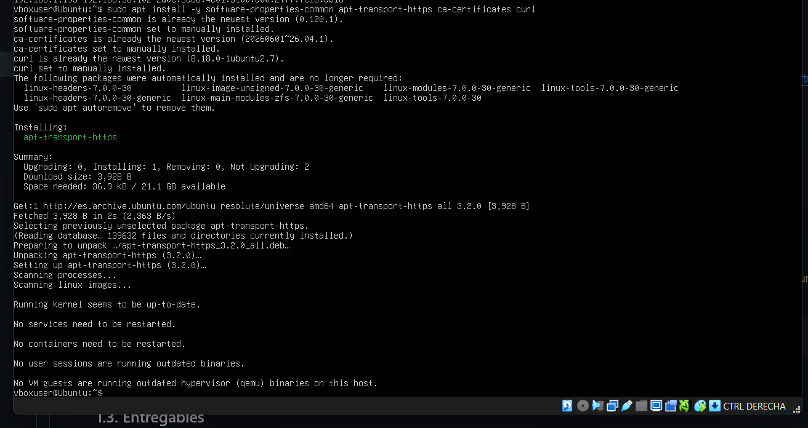
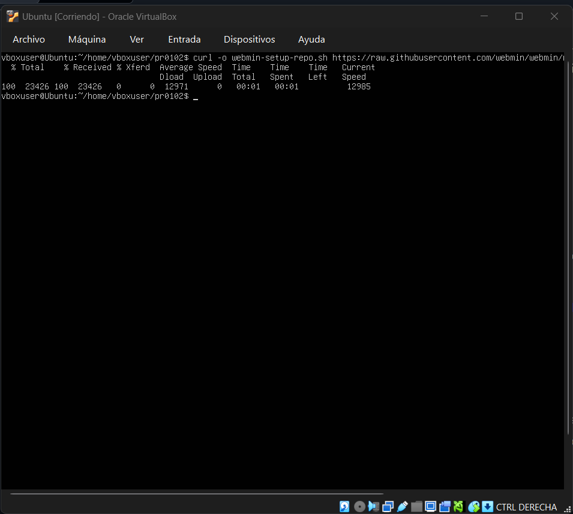
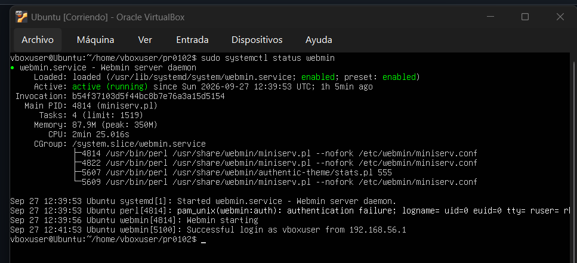
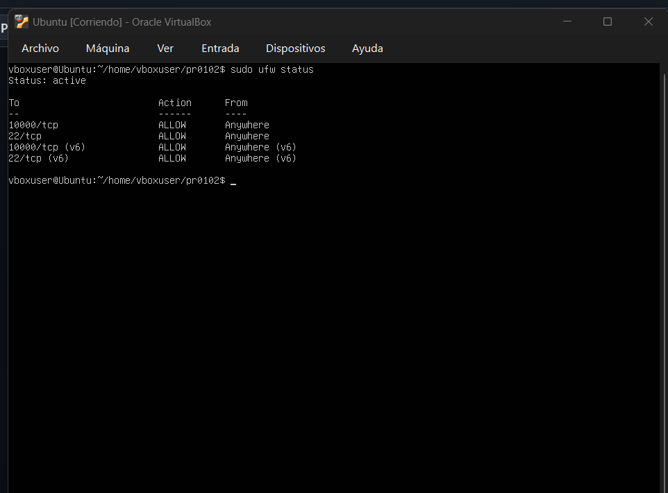
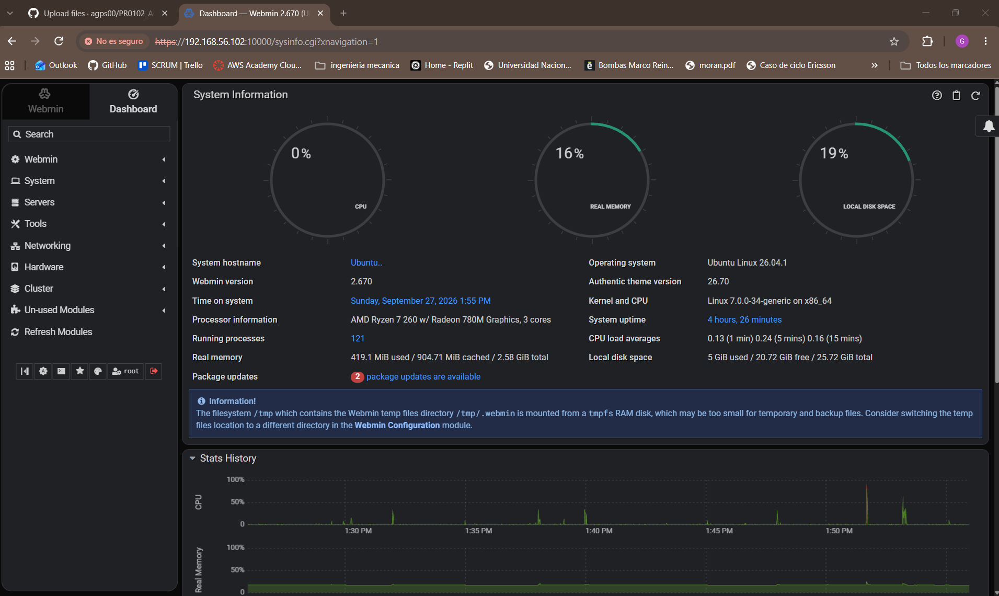

# Práctica 0102 — Despliegue de Aplicaciones Web

## 1. Actualizar los repositorios

Primero actualizamos la información de los repositorios de Ubuntu:

```bash
sudo apt update
```


---

## 2. Instalación del ssh

Se instaló el servidor SSH para permitir la administración remota de la máquina:

```bash
sudo apt install -y openssh-server
```


---

## 3. Instalación de las dependencias de Webmin

Se instalaron las herramientas necesarias para configurar el repositorio de Webmin:

```bash
sudo apt install -y software-properties-common apt-transport-https
```


---

## 4. Descarga del script

```bash
curl -o webmin-setup-repo.sh https://raw.githubusercontent.com/webmin/webmin/master/webmin-setup-repo.sh
```


---

## 5. Configuración del repositorio de Webmin

Este script configura el repositorio necesario para poder instalar Webmin mediante APT.

```bash
sudo sh webmin-setup-repo.sh
```


---

## 6. Instalación Webmin

Se actualizaron otra vez los paquetes, seguido de la instalación de Webmin

```bash
sudo apt update
```
```bash
sudo apt install -y webmin
```


---

## 7. Comprobación del servicio Webmin

Una vez instalado Webmin, se comprobó que el servicio estaba funcionando:

```bash
sudo systemctl status webmin
```


---

## 8. Configuración del firewall

Se configuró UFW para permitir las conexiones SSH y el acceso a Webmin.

Primero se permite SSH:
```bash
sudo ufw allow ssh
```
Después se permite el puerto utilizado por Webmin:
```bash
sudo ufw allow 10000/tcp
```
Finalmente se activa el firewall:
```bash
sudo ufw enable
```
Veremos el estado del Firewall:
```bash
sudo ufw status
```


---

## 9. Accedemos a Webmin

Para ello debemos copiar: 
 ```text
https://192.168.56.102:10000
```


---

Nota: Previamente consultamos la ip utilizada

```bash
ip a
```

---

## 10. Dentro de Webmin

Accedemos como root con la contraseña ya cambiada.



---

## Automatizar la instalación y configuración de Webmin.

El fin de esta práctica es automatizar el proceso realizado,entonces se realiza un script y este se ejecuta de la siguiente manera: 

```bash
chmod +x scripts/webmin-install.sh
```
luego: 

```bash
sudo ./scripts/webmin-install.sh
```


